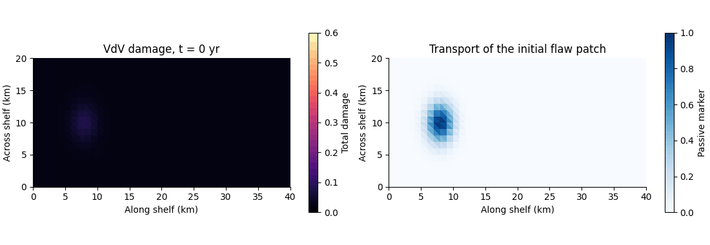

# Van der Veen crevasse mechanics as a damage law

This repository rewrites the van der Veen surface and basal crevasse criteria
as a prognostic law for the fractured thickness fraction

$$
D=D_s+D_b=\frac{d_s+d_b}{H}.
$$

The literal LEFM form is

$$
\frac{\mathrm{D}D}{\mathrm{D}t}
=\frac{v_s}{H}\mathcal F\left(\frac{K_{\mathrm I}^{\mathrm s}}{K_{\mathrm{Ic}}}\right)
+\frac{v_b}{H}\mathcal F\left(\frac{K_{\mathrm I}^{\mathrm b}}{K_{\mathrm{Ic}}}\right),
\qquad D<1.
$$

The Freund-style kinetic function is

$$
\mathcal F(q)=
\begin{cases}
0, & q<1,\\
1-q^{-2}, & q\geq 1.
\end{cases}
$$

The stress-intensity factors and fracture threshold follow van der Veen. The
kinetic closure follows the Freund formulation used by Lipovsky (2018). The
note also gives a reduced algebraic zero-stress version and observational
predictions that could test the assumed kinetics.

## Files

- damage_law.tex — model assumptions, derivation, predictions, and limitations
- damage_law.pdf — compiled technical note
- damage_law_demo.ipynb — minimal NumPy implementation with illustrative figures
- ice_shelf_damage.ipynb — executed 2D Icepack shelf experiment and resolution checks
- vdv.py — finite-slab stress intensities and adaptive Freund source integration
- ice_shelf.py — coupled shelf flow, thickness, and transport of both crack fractions
- figures/ — saved plan-view figures, time histories, and animation
- references.bib — bibliography
- AGENTS.md — repository research instructions
- brad-lipovsky-academic-style-guide.md — academic prose guide
- Makefile — reproducible PDF build

## Build

Run make. The build requires latexmk, pdflatex, and bibtex.

Run `damage_law_demo.ipynb` from top to bottom with Jupyter. It requires only
NumPy and Matplotlib.

## Two-dimensional shelf experiment

Open [ice_shelf_damage.ipynb](ice_shelf_damage.ipynb) to see the saved calculation.
The 40 × 20 km floating shelf evolves for 30 years. Icepack solves momentum
and mass continuity, while separate surface and basal crack fractions grow
according to the full VdV LEFM calculation and advect with the ice. Their sum
weakens the viscosity. The notebook states the initial flaws, inflow and wall
conditions, water pressures, and numerical approximations.



The left panel shows total damage. The right panel follows a passive marker
of the initial basal-flaw patch, identifying transport independently of new
fracture. These are synthetic calculations. The effective crack-speed scales
are 5 m/yr, not measured or Rayleigh speeds. The calculation stops at the
first full-thickness connection; it does not model calving. The load-bearing
viscosity closure is an additional assumption beyond the VdV growth law.

The Dockerfile pins Firedrake's January 2025 image and Icepack commit
`c9a29780cd0f7d068d206cb5a170fa367a7655b0`. From this directory:

```sh
docker build -t vdv-ice-shelf .
docker run --rm -v "$PWD:/work" vdv-ice-shelf \
    python -m pytest test_vdv.py test_ice_shelf.py
docker run --rm -v "$PWD:/work" vdv-ice-shelf \
    jupyter nbconvert --to notebook --execute --inplace \
    --ExecutePreprocessor.timeout=1800 ice_shelf_damage.ipynb
```

Run on one MPI rank. The notebook keeps its figures and outputs, and exports
the animation and PNG figures to `figures/`. A compatible existing Firedrake
environment with Icepack, SciPy, Matplotlib, and Jupyter can also run it.

Verification covers independent quadrature of the stress intensities, the
toughness threshold, dry-crevasse arrest, terminal failure-time convergence,
passive-transport convergence, and a coupled shelf calculation. The notebook
also compares the first five years with a coarser mesh and a smaller timestep.
It does not establish convergence of a long-term calving forecast.
