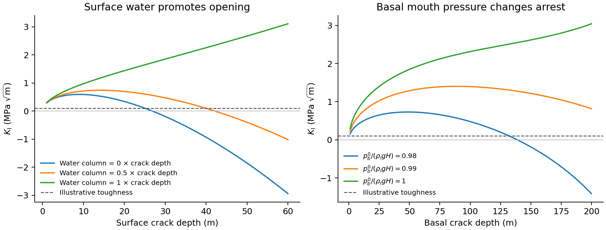

# Van der Veen crevasse mechanics as a damage law

This repository rewrites the van der Veen surface and basal crevasse criteria
as a prognostic law for the fractured thickness fraction

$$
D=D_s+D_b=\frac{d_s+d_b}{H}.
$$

The literal LEFM form is

$$
\frac{\mathrm{D}D}{\mathrm{D}t}
=\frac{v_s}{H}\mathcal F\left(\frac{K_{\mathrm I}^{\mathrm s}}{K_{\mathrm{Ic}}}\right)
+\frac{v_b}{H}\mathcal F\left(\frac{K_{\mathrm I}^{\mathrm b}}{K_{\mathrm{Ic}}}\right),
\qquad D<1.
$$

The Freund-style kinetic function is

$$
\mathcal F(q)=
\begin{cases}
0, & q<1,\\
1-q^{-2}, & q\geq 1.
\end{cases}
$$

The stress-intensity factors and fracture threshold follow van der Veen. The
kinetic closure follows the Freund formulation used by Lipovsky (2018). The
note also gives a reduced algebraic zero-stress version and observational
predictions that could test the assumed kinetics.

## Files

- damage_law.tex — model assumptions, derivation, predictions, and limitations
- damage_law.pdf — compiled technical note
- damage_law_demo.ipynb — minimal NumPy implementation with illustrative figures
- stress_intensity.py — surface and basal stress intensities from a prescribed ice state
- stress_intensity_demo.ipynb — executed examples of depth, water, orientation, and array inputs
- test_stress_intensity.py — independent quadrature and physical-limit checks
- ice_shelf_damage.ipynb — executed 2D Icepack shelf experiment and resolution checks
- vdv.py — finite-slab stress intensities and adaptive Freund source integration
- ice_shelf.py — coupled shelf flow, thickness, and transport of both crack fractions
- figures/ — saved plan-view figures, time histories, and animation
- references.bib — bibliography
- AGENTS.md — repository research instructions
- brad-lipovsky-academic-style-guide.md — academic prose guide
- Makefile — reproducible PDF build

## Build

Run make. The build requires latexmk, pdflatex, and bibtex.

Run `damage_law_demo.ipynb` from top to bottom with Jupyter. It requires only
NumPy and Matplotlib.

## Two-dimensional shelf experiment

Open [ice_shelf_damage.ipynb](ice_shelf_damage.ipynb) to see the saved calculation.
The 40 × 20 km floating shelf evolves for 30 years. Icepack solves momentum
and mass continuity, while separate surface and basal crack fractions grow
according to the full VdV LEFM calculation and advect with the ice. Their sum
weakens the viscosity. The notebook states the initial flaws, inflow and wall
conditions, water pressures, and numerical approximations.


The left panel shows total damage. The right panel follows a passive marker
of the initial basal-flaw patch, identifying transport independently of new
fracture. These are synthetic calculations. The effective crack-speed scales
are 5 m/yr, not measured or Rayleigh speeds. The calculation stops at the
first full-thickness connection; it does not model calving. The load-bearing
viscosity closure is an additional assumption beyond the VdV growth law.

The Dockerfile pins Firedrake's January 2025 image and Icepack commit
`c9a29780cd0f7d068d206cb5a170fa367a7655b0`. From this directory:

```sh
docker build -t vdv-ice-shelf .
docker run --rm -v "$PWD:/work" vdv-ice-shelf \
    python -m pytest test_vdv.py test_ice_shelf.py
docker run --rm -v "$PWD:/work" vdv-ice-shelf \
    jupyter nbconvert --to notebook --execute --inplace \
    --ExecutePreprocessor.timeout=1800 ice_shelf_damage.ipynb
```

Run on one MPI rank. The notebook keeps its figures and outputs, and exports
the animation and PNG figures to `figures/`. A compatible existing Firedrake
environment with Icepack, SciPy, Matplotlib, and Jupyter can also run it.

Verification covers independent quadrature of the stress intensities, the
toughness threshold, dry-crevasse arrest, terminal failure-time convergence,
passive-transport convergence, and a coupled shelf calculation. The notebook
also compares the first five years with a coarser mesh and a smaller timestep.
It does not establish convergence of a long-term calving forecast.

## Stress intensity factors from an ice state

`stress_intensity_factors(state)` returns `(K_surface, K_basal)` in
Pa √m, using the full finite-slab LEFM equations in the technical note.
The function requires only NumPy and accepts scalars or broadcastable arrays:

```python
from stress_intensity import stress_intensity_factors

state = {
    "thickness": 400.0,                         # m
    "membrane_stress": [[150e3, 0], [0, 75e3]], # Pa, not thickness-integrated
    "crack_normal": [1.0, 0.0],                # horizontal unit normal
    "surface_depth": 20.0,                     # m
    "basal_depth": 60.0,                       # m
    "surface_water_depth": 0.0,                # m above the surface crack tip
    "basal_water_pressure": 917*9.81*400,       # Pa, prescribed here at flotation
}
K_surface, K_basal = stress_intensity_factors(state)
```

Supply the membrane stress tensor `M = tau_horizontal + tr(tau_horizontal) I`;
the function calculates the normal resistive stress `n @ M @ n`. Its final
two axes must be `(2, 2)`, and the normal's final axis must be `(2,)`.
All other field axes broadcast to the output shape. An Icepack stress in MPa
must be converted to Pa. Given damage fractions, use `surface_depth = H*D_s`
and `basal_depth = H*D_b`.

The caller supplies stress consistently with the chosen rheology and provides
both water boundary conditions. Velocity alone does not specify the required
state. Existing flaws must have positive depths and retain a positive ligament
(`surface_depth + basal_depth < thickness`). The function returns signed stress
intensities without clipping, adding a kinetic law, or changing the stress
to account for damage. The finite-slab approximation omits grounded basal
contact and interactions between cracks.

Open [stress_intensity_demo.ipynb](stress_intensity_demo.ipynb) for saved
figures and calculations, including a 2D array example. The notebook states
the assumptions and units and shows how measured arrest depths could test
the LEFM criterion. Its states are synthetic and prescribed, not ice-flow
solutions.



To reproduce the notebook and checks in a Python environment:

```sh
python -m pip install numpy scipy matplotlib pytest nbconvert ipykernel
python -m pytest test_stress_intensity.py
jupyter nbconvert --to notebook --execute --inplace \
    --ExecutePreprocessor.timeout=300 stress_intensity_demo.ipynb
```

The notebook retains its figures and outputs and exports PNGs to `figures/`.
Tests compare independent adaptive quadrature, hydrostatic cancellation,
coordinate rotation, scalar/grid agreement, and the stated domain limits.
